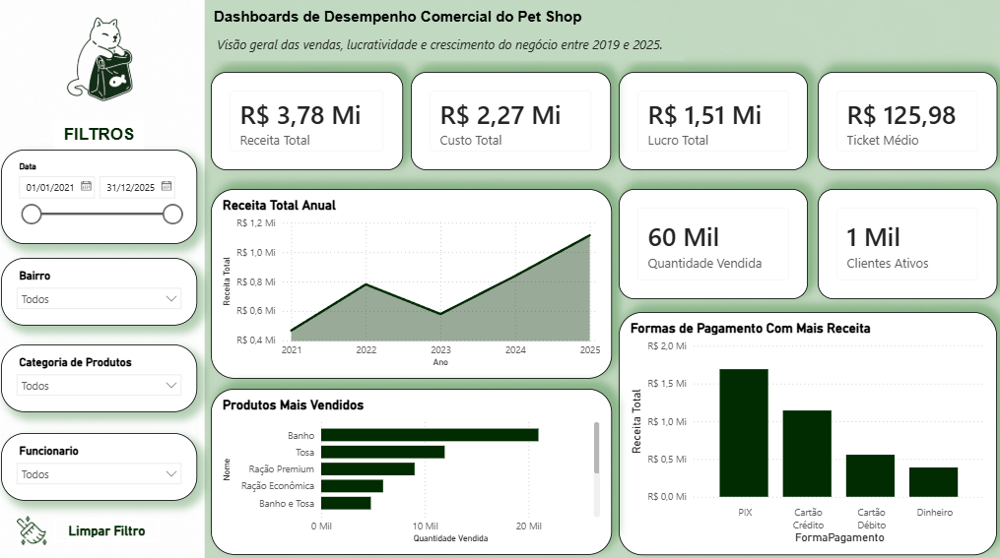

# 🐾 Dashboard de Desempenho Comercial de um Pet Shop

## 📖 Sobre o Projeto

Este projeto foi desenvolvido com o objetivo de simular um cenário real de análise de dados para um Pet Shop de bairro utilizando Power BI.

A proposta foi construir uma solução completa de Business Intelligence, desde a modelagem dos dados até a criação de indicadores e visualizações que auxiliem na tomada de decisão. Para isso, foi criada uma base de dados fictícia representando as operações da empresa entre os anos de 2021 e 2025.

O cenário foi elaborado para reproduzir situações comuns encontradas em pequenos negócios, como crescimento gradual da empresa, variações de faturamento ao longo dos anos, diferenças de desempenho entre produtos e serviços, comportamento dos clientes e preferências de formas de pagamento.

O resultado é um dashboard executivo capaz de fornecer uma visão consolidada do desempenho comercial e financeiro do negócio.

---

## 📷 Dashboard

---

## 🎯 Objetivo

O principal objetivo deste projeto foi aplicar conceitos fundamentais de Business Intelligence e Análise de Dados, incluindo:

* Modelagem dimensional (Star Schema)
* Construção de métricas utilizando DAX
* Criação de indicadores de desempenho (KPIs)
* Desenvolvimento de dashboards interativos
* Storytelling com dados
* Boas práticas de visualização

---

---

## 📈 Visualizações Implementadas

### Receita Total por Ano

Permite acompanhar a evolução da empresa ao longo do tempo.

No cenário criado:

* 2021 representa o início das operações.
* 2022 apresenta crescimento.
* 2023 apresenta queda de desempenho.
* 2024 mostra recuperação.
* 2025 representa o melhor ano da empresa.

### Produtos e Serviços Mais Vendidos

Exibe os itens com maior volume de vendas, permitindo identificar os principais responsáveis pelo faturamento.

### Receita por Forma de Pagamento

Mostra como os clientes realizam seus pagamentos.

Exemplos:

* PIX
* Cartão de Crédito
* Cartão de Débito
* Dinheiro

### Filtros Interativos

O dashboard permite análises por:

* Data
* Bairro
* Categoria
* Funcionário

---

## 🛠️ Ferramentas Utilizadas

* Power BI
* DAX
* Power Query
* Excel
* Modelagem Dimensional (Star Schema)
* ETL

---

## 🚀 Resultado

O projeto demonstra a aplicação prática de técnicas de Business Intelligence em um cenário próximo da realidade empresarial.

A solução permite analisar o desempenho comercial do Pet Shop de forma rápida e intuitiva, fornecendo informações relevantes para acompanhamento dos resultados e suporte à tomada de decisão.

Além do dashboard, o projeto serviu como exercício para consolidar conhecimentos em modelagem de dados, criação de métricas DAX, desenvolvimento de KPIs e construção de visualizações executivas utilizando Power BI.

---

## 👨‍💻 Autor

**Guilherme Humberto**

Projeto desenvolvido para fins de estudo, prática e construção de portfólio na área de Business Intelligence e Análise de Dados.
